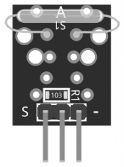
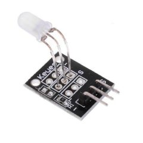
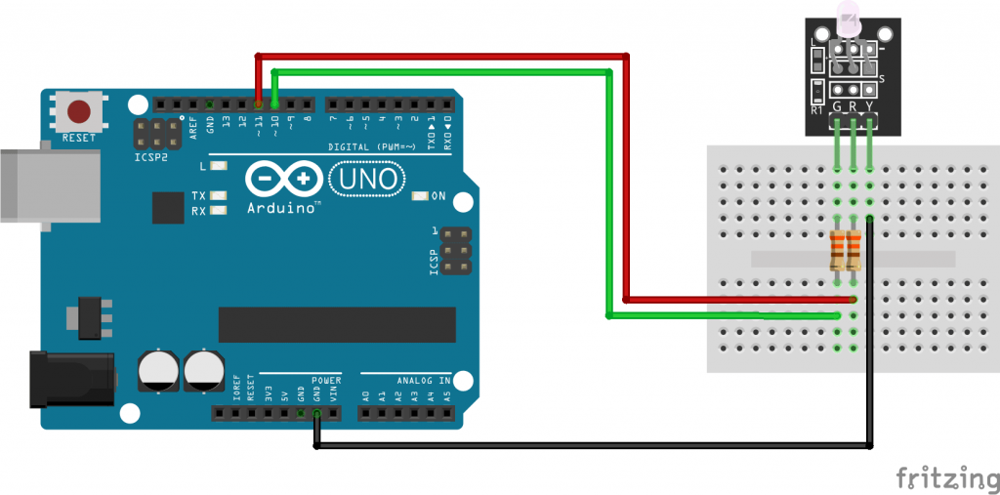

# 2-color-LED-module


Módulo LED bicolor de 3mm KY-011 para Arduino, emite luz roja y verde. Puede ajustar la cantidad de cada color usando PWM. Este módulo es similar al KY-029 .





*Especificaciones*

Este módulo consta de un LED rojo / verde de cátodo común de 3 mm y una resistencia de 0 Ω. Dado que el voltaje de funcionamiento es de 2,0 v ~ 2,5 v, deberá utilizar resistencias limitadoras para evitar el desgaste al conectarse al Arduino

| Tension de funcionamiento | 3.3V hasta 5V |
|---------------------------|---------------|
| Tipo de salida            | Digital       |


*Diagrama de conexión KY-021*

Usaremos un par de resistencias de 330Ω para limitar la corriente del Arduino y evitar que se queme el LED.

| KY-021 | Arduino  |
|--------|----------|
| S      | Digital2 |
| medio  | +5V      |
| -      | GND      |


Diagrama de conexión KY-021
Código de ejemplo KY-021 Arduino

El siguiente boceto de Arduino alternará gradualmente entre el color rojo y verde.

```
int redpin = 11; // pin for red signal
int greenpin = 10; // pin for green signal
int val;

void setup() {
	pinMode(redpin, OUTPUT);
	pinMode(greenpin, OUTPUT);
}

void loop() {
	for(val = 255; val > 0; val--) { 
		analogWrite(redpin, val); //dim red
		analogWrite(greenpin, 255 - val); // brighten green
		delay(15);
	}
	for(val = 0; val < 255; val++) { 
		analogWrite(redpin, val); //brighten red
		analogWrite(greenpin, 255 - val); //dim green
		delay(15);
	}
}

```
